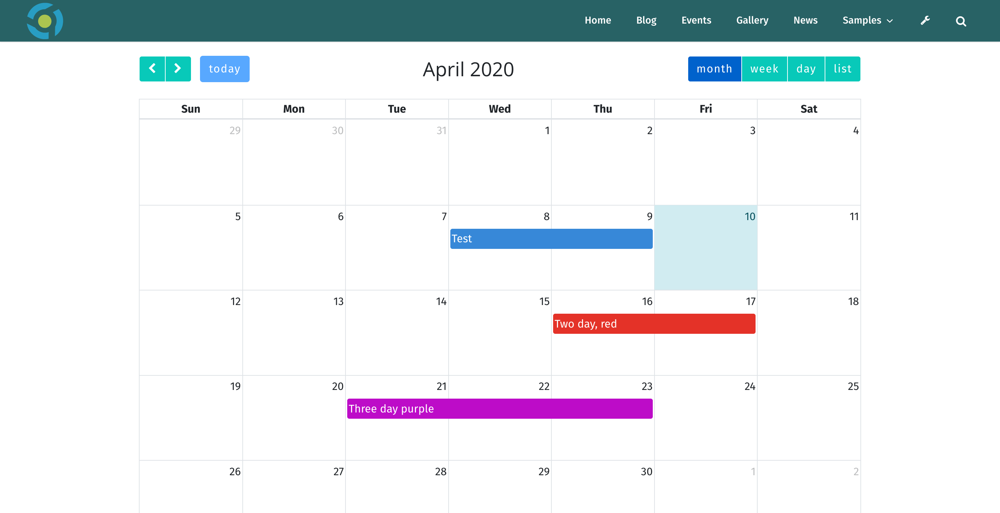
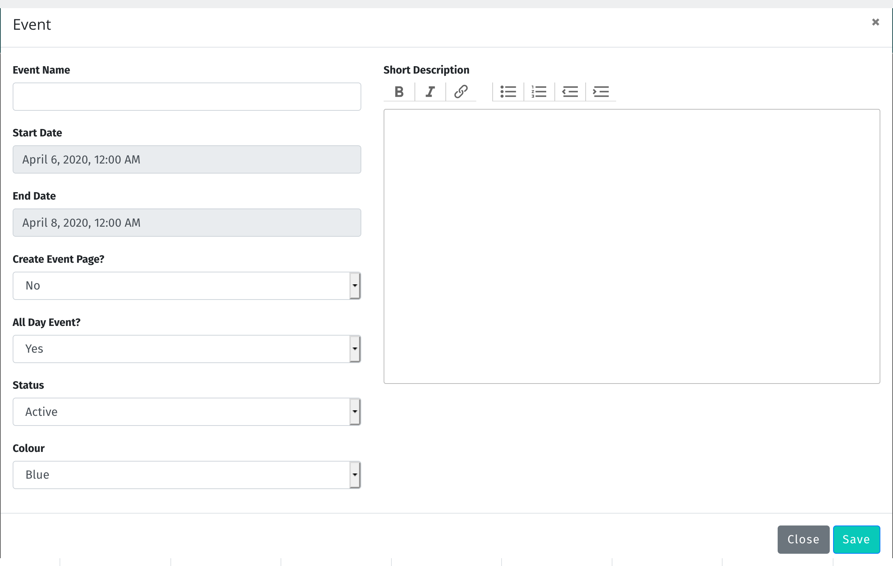

# Calendar Events

	<b>Note</b>: In order to be able to manage calendar events, your system administrator must have assigned you
	the necessary role.

Managing calendar events in GoBlender is easy. Just navigate to the calendar events page while you are logged in, and you'll see the calendar page.

If there are events on the calendar, you can edit or delete them. You can also create new events.

## Creating Calendar Events

To create an event, just click in the date where you want the event to appear, or click and drag over a range of dates to select a date range.

The **Event Dialog** appears:

Here you can set the event dates and times, decide whether it is an all day event or not, and set events to active/inactive. You can also change the colour of an event. 

Many calendar events do not require a click-through page, but if you wish to have one, just choose **Yes** from the **Create Event Page** drop down. After you save the event, go to the event page simply by clicking on the event in the calendar. The event page is managed like any other page in the site.

The **Short Description** field to the right of the dialog is text that will appear when a user mouses over the event on the calendar, or taps on it with a mobile device.

## Editing Events

To edit an existing event, just right click on it from the calendar, choose the **Edit** menu that appears. The **Event Dialog** will open. Make whatever changes you wish, and click save when you are done.

## Deleting Events

To delete an existing event, just right click on it from the calendar, choose the **Edit** menu that appears. The **Event Dialog** will open. Click on the Delete button.

## Moving Events and Changing Durations

To move an events date/time, simply click on it the event, hold the mouse button down, and drag it wherever it needs to be. To make events longer or shorter, roll your mouse over the rightmost part of the event on the calendar, click and hold the mouse button down, and drag the event to make it longer or shorter.

