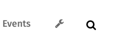
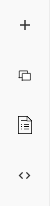

# Content Management System

## Overview

GoBlender comes with an easy to use, drag & drop content management system (CMS). All site content, including pages, blogs, news, and calender
events use the same content management system.

	<b>Note</b>: In order to be able to use the content management system, your system administrator must have assigned you
	the necessary roles. If you do not have the needed role, you will not have the option to use the CMS.

Regardless as to what you are editing, the process is almost exactly the same.

## Making Content Editable

	<b>Note</b>: For all of the editing functions described below, to save your work you must click on <b>Save</b> at the bottom of the screen. To cancel,
	and return to the last saved state of the page, click <b>Cancel</b>, and to delete a page, post, or news item while editng, click on <b>Delete</b>.

In order to edit a page, news item, or blog post, simply follow these steps to enable the CMS:

1. Make sure you are logged in.
1. Navigate to the page you want to edit.
1. Roll your mouse over the "wrench" icon, in the far right of the navigation bar at the top of the page, and click on it.
1. Choose "Edit Page" from the drop down menu that appears (**Note**: this will say "Edit Post" for blog posts, and "Edit News Item" for news items).

     
    <em>The Wrench Menu</em>

Once you follow these three steps, the page will become editable.

A new menu appears along the **left side of the screen**. This is the **Content Strip** which you use to insert sections or snippets into the page,
or to use a saved template to make creating a new page a snap. These are discussed in more detail below.

     
    <em>The Content Strip</em>

## Sections & Snippets

In order to make managing your content as simple as possible, every page, blog post, and news item consists of **at least the following**: One section
and one snippet. In other words, **every section has at least one snippet, and every page has at least one section**.

	<b>Remember</b>: Every page must have at least one section, and every section must have at least one snippet. If you don't have a section on a page
	and you try to add a snippet, you will not be able to do so!

### Working with Sections

The process is very easy. To **Add a section to a page**, click on the **+** icon at the top of the **Content Strip**. A panel will fly out,
giving you a pre-built list of sections that you can add to your page. Be sure to note the categories along the top. Look around until you find
one that you think you might use (remembering that you have full control over the images, text, and so forth, and can change them once you add
the section to the page).

When you find one you like, just click or tap to choose it, and the section will be added to the **bottom of the current page**.

The pre-built sections are probably not exactly what you want. Fortunately, you have complete control over every section. To change a section,
simply roll your mouse over it, and you will notice two icons that appear at the bottom of the section, in the middle: An image icon, and a wrench.

These are the **Cover Settings**  and **Box Settings** for the current section. Click on the wrench, and you will have all the tools you need to
customize many features for the current section.

Specifically, you can:

* Change the width of the content in the section
* Change the background color of the section
* Add a gradient background to the section
* Change the positioning of the content within the section
* Make the text light or dark
* Manage transparency levels

The other icon, **Cover Settings**, allows you to set a background image for the section. Clicking on the **Cover Settings** icon allows you to
browse your system for an image to use as a background for the current section.

	<b>Note</b>: Although GoBlender will do its best to process whatever image you choose to use as a background to make it web friendly,
	use caution when choosing an image. For best results, choose an image that is at least 1200 pixels wide, and set to 72dpi. JPEG images are
	also usually much smaller than PNG images. If you put up a huge image, your page will load slowly, and you will have unhappy visitors!

### Moving Sections Around

When you add a section to a page, it is added at the bottom. In most cases, that is not where you want it to go. Fortunately, it is easy
to move sections around in GoBlender.

To move a section, make sure you are **editing the page**, and roll your mouse over the section you want to move. On the **far right** of the screen
you will see two icons: a **blue wrench**, which opens the **Section Settings Dialog**, and a **red x**, which allows you to delete the section
if you decide that you don't want it on your page.

To move a section, click on the **blue wrench**, and the **Section Settings Dialog** appears. To move a section around, use the arrows at the top of
the dialog. To change the veritical size of the section, use the buttons in the middle. If your section is very tall, you may wish to enable
the "Scroll icon" to let visitors know that there is additional content to be found further down on the page. Check the box to enable the scroll
icon, or uncheck to get rid of it.

### Snippets

While the pre-defined page sections are useful, in most cases you will want more control over the content of a page, and how it is presented
to visitors. That's where snippets come in.

	Remember: snippets do not live on the page by themselves! Every snippet must go into a section!

Snippets are found by clicking on the second icon from the top of the **Content Strip** on the left side of the screen (it looks like two
squares stacked on top of each other). When you click on it, a scrollable panel slides out from the left side of the screen. These are your pre-defined
snippets, and there are several hundred to choose from.

For quicker access, there is a drop down list at the top of the snippet panel that sorts things by category. Once you have found a snippet that
you want to use, simply click on it  and **hold the mouse button down**, and then drag it into a section on your page. A light grey bar will appear
whenever you have it in a place where it can be dropped. Once you have it where you want it, release the mouse button, and the snippet appears on your
page.

Of course, the default content of a snippet is not what you want, but you can change images, text, video, maps, etc. quickly and easily.

#### Changing text in a snippet

To edit the textual content of a snippet, just click in it. An editing bar will appear that the top of the screen, and you can type at will.
You can change text color, font, size, etc. just as you would in a word processor.

#### Changing images in a snippet

Many snippets have placeholder images that you can replace with your own images. Doing so is easy. Just click on the image you want to change,
and several icons will appear at the top of the image, in the center:
1. an image icon: use this for quick, one time changes. Just click on it and browse your computer for the image you want to use.
2. a link icon: in most cases, **this is the way you should change your images**. Clicking on the link will pop up a dialog, where you can set
the title for the image (used by screen-readers for the visually impaired, and to let search engines know something about the image so that it
will be indexed properly by Google, Bing, etc.); you can link the image to somewhere else by filling out the "Link" box; and you will notice  **three dots** to the right of the file box at the top of the dialog. This links to the **image manager**, which
makes it simple to upload images to the server for use anywhere on your site.
3. a pencil icon: this allows you to quickly and easily crop your images to standard image sizes.

#### Putting files (like PDFs) on your site

A common use case for web pages is to link to other kinds of files, like PDFs, Microsoft Excel files, etc. This is easy to do with GoBlender.
To link to a file, just **edit the page**, then follow these steps:

1. Hightlight the text that you want to be linked to a file.
2. Click on the "hyperlink" icon in the **editing bar** at the top of the screen (it looks like a chain link).
3. A dialog box will appear. Click on the three dots in the top right.
4. The **File Manager** window will appear. If the file you want is alread there, just click on it. If not, upload it, and then click on it.
5. Click Okay. Your text is now linked to the file.

## Saving Page Templates

In many cases, at lot of your pages will have a similar layout. For example, all blog posts might have a "hero header" at the top with some
background image, and the blog post is beneath it, or all of your press releases will have a similar look and feel. While it is easy enough
to create a these pages using Sections and Snippets, you can also build specific templates and save them for later use. This is where
**Templates** come into play.

To create a template, first create a new page by going to the wrench menu and choosing **Add Page**.

Next, build the page the way you want it to look. When you have it ready, just click on "Save Template" button in the bottom right.
A dialog box will appear asking you to name the template. Give it a meaningful name, and click save. You have saved your template.

## Using Page Templates

	<b>Warning</b>: choosing a saved template will completely replace the current page with the template! If you didn't want to do this,
	click Cancel at the bottom of the screen!

Saved templates can be used on site pages, blog posts, or news items. To use a template, first either create a new page, or edit an existing one.
To use the template, click on the "Page" icon in the **Content Strip** (it's the third one from the top). A panel will slide out from the
left of the screen displaying your saved templates.

Click on the template that you want to use, and click okay in the confimration dialog that appears.

Your page is now replaced with the selected template.

## Modifying HTML

If you have the necessary permissions to do so, and you are comfortable editing HTML directly, you can access the HTML for the full page by
clicking on the bottom icon on the **Content Strip**. Just click on it, and you will see the full HTML for the current page.

If you want to modify the HTML for a given snippet, though, instead of the full page, edit the page (from the **wrench menu**), click in the snippet
you want to work on, and then click on the yellowish **...** button on the top, or on the right. You can access the snippet's HTML from there.

If you don't see the HTML icon on the **Content Strip** on in the **...** menu, go to your profile page (under the **wrench menu**) and turn on
the **Enable advanced editing tools** toggle button.

