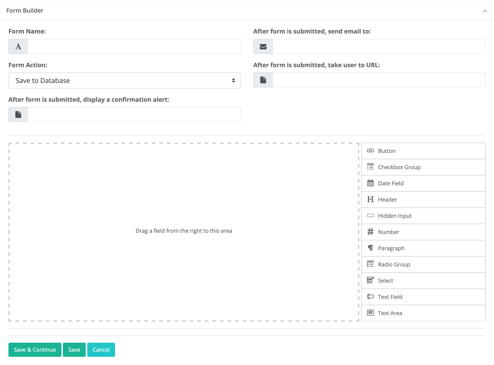
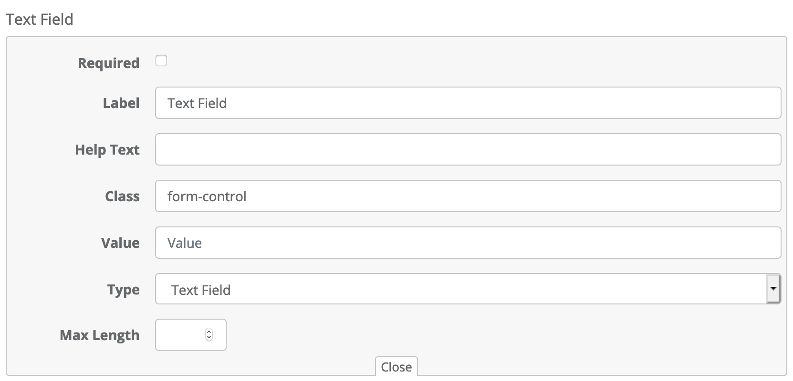

# Creating Forms

Goblender has a fully-featured form builder integrated into the content management system. With this tool, you are able to create sophisticated forms
that are sent to any email address you wish, saved to the database, or both.

	<b>Note</b>: In order to be able to manage forms, your system administrator must have assigned you
	the necessary role.

Building forms is a simple process: you simply drag and drop the form elements you want, where you want, and in the order you want. You can include
almost any form element you wish.

Naturally, all forms have validation and cross-site forgery request protection built in.

### Creating a Form

To create a new form, go to the dashboard and choose Forms -> Add Form from the left hand menu. A new, blank form page appears. 

Any form you create can be saved to the database. If you save the form to the database, you can view the data and export it to Microsoft Excel at any
time. 

Forms can also be emailed to any email address that you wish.

	<b>Note</b>: In order to be able to email forms, you must have your email server settings correctly entered into the preferences page.
	In most cases, you will want to save completed forms to the database, and optionally send an email. Having a form sent via email alone
	is not recommended.

Fill in the required fields at the top of the page ("Form Name" and "After form is submitted, display a confirmation alert"), and then drag and drop form elements onto the blank form.

Every form element is fully customizable. To display the options for a given form element, roll your mouse over the upper right hand corner of the element
and click on the pencil icon that appears. The form element options panel will appear:

The **Label** is the text that appears in the following places: on the form itself, in the email that is sent once the form is submitted (if any), 
and as the column name in the exported Microsoft Excel document (if the form is saved to the database). The other fields should be self-explanatory.

To delete a form element, roll your mouse over the upper right hand corner of the element and click on the X icon.

If you wish to duplicate an existing form element, roll your mouse over the upper right hand corner of the element and click on the double box icon.

## Editing Forms

To edit an existing form, navigate to the dashboard and choose Forms -> All Forms from the left hand navigation menu. A list of your existing forms will
appear. Click on the name of the form you wish to edit, and the form page will appear. What you can do at this point depends on whether or not you
already have information in the database associated with this form.

If you have no repsonses in the database, you can do whatever you wish. If, however, your form is live and you have saved responses, you will only have
limited edit abilities.

	<b>Note</b>: If your form has saved responses in the database, you will be unable to rearrange form elements, add elements, or delete elements.
	This is simply because doing so would change the number or order of fields in the database, and exporting your form data would be adversely 
	affected.

Edit an existing form in the same way that you create a new form.

## Using a Form

To put the form on your public facing website, navigate to the page where you want the form to appear and choose **Edit page** from the **wrench menu**.
Then click on the "F" on the content strip along the left side of the page. A panel will slide out, listing all of your active forms. Click on the form
you wish to use, and it will be appended to the bottom of the current page, in its own section. You can then move the form wherever you wish.

	<b>Important</b>: If you make changes to a form that is already in use on your site, you <strong>must replace the existing form with the updated
	version.</strong> To do so, navigate to the page where the form exists, deleted the entire section with the form, and then re-add it by 
	following the steps above.

