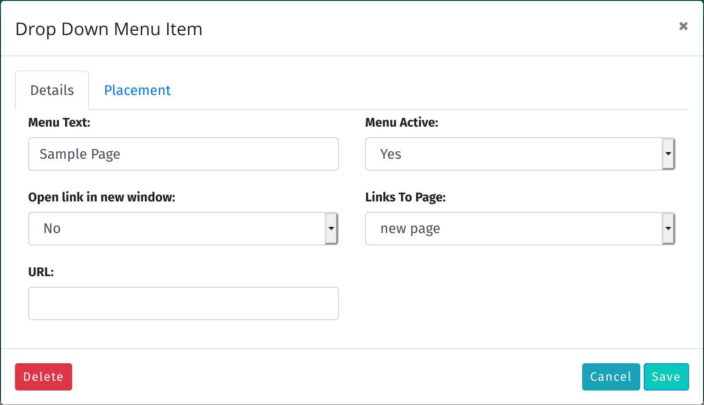

# Working with menus

The primary means of navigating your site is the main menu, found at the top of every public facing page. Working with menus is
easy, and you have complete control over the items found in the menu, and what each item links to.

	<b>Note</b>: In order to be able to manage menu items, your system administrator must have assigned you
	the necessary role. If you do not have the needed role, you will not have the option to modify the menu.

## Managing Top Level Menu Items

To manage top level menu items, first log into the site and then go to any public facing page. Roll your mouse over the menu item
you want to work with, and then **right click on it** (Windows) or **Control-click** or **two finger click** (Mac). A small popup
menu labelled "Edit" will appear. Click on this, and the Menu Dialog appears:

There are two tabs along the top of the dialog. The first tab, **Details**, has six options:

This dialog is where you set all of the menu properties:

1. Menu Text - this is the text that the menu will have
2. Is dropdown menu - Yes or no. If yes, then this menu will be a drop down menu.
3. Open link in new window - Yes or no. If yes, then when the user selects this menu item, the link will be opened in a new browser window.
4. Menu Active - Yes or no. If No, then the menu will not appear to end users (although you will still be able to see it if you are logged in).
5. Links to Page - If you want the menu item to link to a page on your site, choose the page from this list.
6. URL - If you want the menu item to lik to a specific url, paste the url into this text box.

The second tab, **Placement** allows you to drag the menu items into a specific order. Just arrange them the way that you want, click save, and you are done.

## Adding Top Level Menu Items

To add a top level menu item, just choose **Add menu item** from the **wrench menu**. A blank menu dialog will appear.

## Deleting Top Level Menu Items

To delete a menu item, right click on it and click the red Delete button.

## Managing Drop Down Menu Items

To manage drop down menu items, first log into the site and then go to any public facing page. Roll your mouse over the drop down menu item
you want to work with, and then **right click on it** (Windows) or **Control-click** or **two finger click** (Mac). A small popup
menu labelled "Edit" will appear. Click on this, and the Menu Dialog appears:

There are two tabs along the top of the dialog. The first tab, **Details**, has five options:

This dialog is where you set all of the drop down menu properties:

1. Menu Text - this is the text that the menu will have
1. Open link in new window - Yes or no. If yes, then when the user selects this menu item, the link will be opened in a new browser window.
1. Menu Active - Yes or no. If No, then the menu will not appear to end users (although you will still be able to see it if you are logged in).
1. Links to Page - If you want the menu item to link to a page on your site, choose the page from this list.
1. URL - If you want the menu item to lik to a specific url, paste the url into this text box.

The second tab, **Placement** allows you to drag the menu items into a specific order. Just arrange them the way that you want, click save, nd you are done.

## Adding Drop Down Menu Items

To add a drop down menu item, just choose **Add menu item** from the drop down menu you wish to add it to. A blank drop down menu dialog will appear.

## Deleting Top Level Menu Items

To delete a drop down menu item, right click on it and click the red Delete button.
