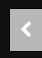
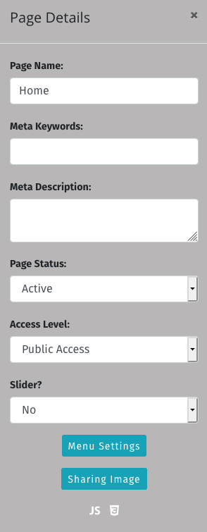
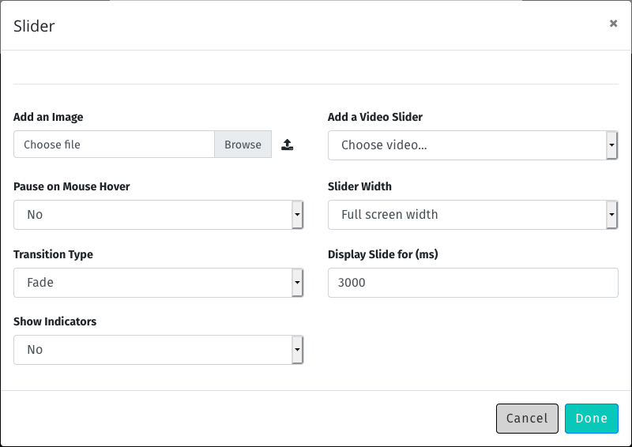
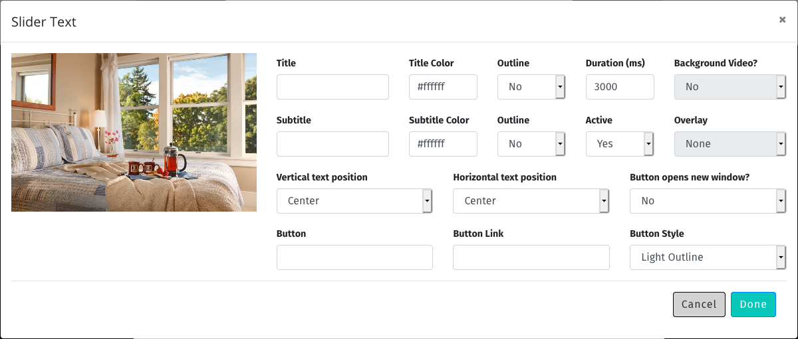

# Working With Pages

<div style="background: #fff3cd; padding: 1em; border-radius: 1em; text-align: left; font-weight: normal; margin-bottom: 1em;">
	<b>Note</b>: This section assumes that you are already familiar with the <a href="#/cms">Content Management System</a>
</div>

<div style="background: #ffcccb; padding: 1em; border-radius: 1em; text-align: left; font-weight: normal;">
	<b>Note</b>: In order to be able to manage pages, your system administrator must have assigned you
	the necessary role.
</div>

Managing pages on the site is easy. Every page on a GoBlender site is managed the same way.

Note that for the purposes of this guide, we draw a distinction between **pages**, **blog posts**, **news items**, and **calendar events**.
Although most of the functions used to manage content are the same, there are a few differences to be found among these four kinds of content.

Watch the video below to see a basic page editing session, or read one for more detail.


<div style="width: 100%;">
	<div  style="width: 400px; margin-left: auto; margin-right: auto;">
<video width="400" controls>
  <source src="videos/basic-page.mp4" type="video/mp4">
  Your browser does not support HTML5 video.
</video>
</div>
</div>


Whenever you create an new page or edit an existing one, the screen will change to provide you with the tools necessary to do so. As we
saw in the [Content Management System](/#/content-management-system) section, you get a **Content Strip** along the left, and some **buttons**
(save, cancel, etc.)along the bottom. You will also notice a new button along the right hand side of the screen: a light grey box with a "<" symbol.



If you click on this button, called the **Edit Panel**, a pane will slide out from the right, revealing the basic page details.



Here is where you can do the following:

### Set the page name

The page name can be whatever you wish, but is limited to 255 characters in length. Whatever you type here will be converted to a web-friendly
URL, using the following logig:

1. Spaces are converted to dashes
2. Special characters are removed
3. Everthing is converted to lower case

So, if you were to name your page "Announcement: General Membership Meeting on July 12th", the automatically generated URL for the page would be
`/announcement-general-membership-meeting-on-july-12th`

#### Duplicate page names

Sometimes you may give two or more pages the same name, either on purpose or inadvertently. In that case, the generated URL for the page will have a number appended to it, so that there are no duplicate URLs on the site. For example, if you create two pages named "About", the first would have the URL of
`/about`, and the second would be given `/about-1`. This is an automatic process.

#### Changing the URL of a page

Typically, you don't want the URL of a page to change, ever. Thus, once a page is saved, its URL becomes immutable. For example, if you name a page "About"
and then save it, its URL will be `/about`. If you then edit the page and change the name to `About My Company`, the **URL wil not change**. If you wish
to change the URL of the page, you must copy its content, create a new page, paste the content in, and give the page a new name. You can then
safely delete the old page.

### Meta Keywords

Meta keywords are hidden tags which appear in the `<head>` section of a web page. They are largely ignored by search engines these days, but
if you wish, you can enter a comma-separated list of keywords related to the page content.

If you set the meta tags, save the page, and then view source on your page, somewhere near the top you'll see a tag like this:

```html
<meta name="keywords" content="goblender, verilion, cms">
```

### Meta Description

The meta description is a hidden html tag which appears in the `<head>` section of a web page. If you wish, you can enter a brief description of your
page in this section. Search engines will sometimes, but not always, use this section when previewing your page in search results.

If you set the meta description, save the page, and then view source on your page, somewhere near the top you'll see a tag like this:

```html
<meta name="description" content="The official site for GoBlender, a content management system developed by Verilion Inc.">
```

You will also see tags like this:

```html
<meta property="og:title" content="GoBlender">
<meta property="og:description" content="The official site for GoBlender, a content management system developed by Verilion Inc.">
```

These are [Open Graph](https://ogp.me/) tags, which are used by many popular social media sites. As you can see, the title is taken from the **Page Title** section of
the page's **Edit Panel**, and the description is taken from **Meta Description**. These are automatically generated.

### Page Status

Almost any page on the site can be set to Active or Inactive, except for the home page, which must, for obvious reasons, always be active.

If a page is set to inactive and a visitor to the site tries to access it (by clicking on a bookmark, a search engine result, or just guessing the URL),
they will not be able to do so.

However, if a user is logged in, and has the rights to edit pages, he or she will be able to access the page. A warning notice will be displayed at the
top of the page, alerting you to the fact that the page is currently set to inactive.


### Access Level

Almost any page on the site can be given an access level, except for the home page, which must, for obvious reasons, always be accessible to the public.

There are three possible access levels:

1. Public - the page can be accessed by anyone
2. Account Required - the page can only be accessed by users who have an acccount, and are currently logged in
3. Administrators Only - only logged in users who are site administrators can see the page


### Slider

Pages can have custom sliders which consist of images or video.

In order to enable a slider for any page of the site, simply select "Yes" from the drop down menu labelled **Slider?** and a new button will appear below it,
labelled **Manage Slider.**

Clicking on the Manage Slider button will open the slider management dialog.




A newly created slider will have no slides. To add an image to the slider, click on the **Choose File** button and browser for a slider image, and then
click on the upload button to the right of the browse button. Your image will be uploaded to the server, and converted to several different versions (one for
phones, one for tablets, one for normal computers, and one for very large screens).

<div style="background: #ffcccb; padding: 1em; border-radius: 1em; text-align: left; font-weight: normal;">
	<b>Warning</b>: If you attempt to upload an image that is too small, GoBlender will refuse to accept it, and tell you the minimum requirements
	for slider images for your system.
</div>

You can have as many images as you like in your slider, but should probably limit it to no more than four or five, so as to keep the page speed
as fast as possible.

Every slide you add will appear at the top of the slider management dialog. You can **drag the slides** to reorder them.

Of course, slides can be more than just pictures; you can add text and buttons to them as well. To do so, once you have a slide uploaded just click
on the **pencil** icon underneath its thumbnail, and enter whatever you wish for text, buttons, and so forth.



To delete a slide, click on the trash can icon underneath its thumbnail. If, however, you think that you will use the slide again in the future, you
can just make it inactive by clicking on the **pencil** icon, and choosing the appropriate value from the drop down menu.


### Menu Settings

Menu settings allows you to manage the way that the top navigation menu appears **for a specific page**.

Sometimes you may wish to have an image at the top of the screen that goes right up to the top, with no menu bar obscuring it. You can do so
by accessing the menu settings dialog by clicking on the **Menu Settings** button.  There are only two options to set:

1. Menu Text: this can be dark or light.
2. Menu Type: this can be normal (the default for your site, usually a light background), or Transparent, which makes the menubar background transparent.

So, if you have a dark image at the top of the page (or a section with a dark background color), and you want the menu to blend into the top of the page,
you can set the menu to transparent, and the menu text to dark.

<div style="background: #ffcccb; padding: 1em; border-radius: 1em; text-align: left; font-weight: normal;">
	<b>Warning</b>: If you inadvertently set the menu text to the same (or a similar) color as the background of the page, it will look a lot like
	your menu has disappared. It hasn't. Roll your mouse around the top of the page and you will discover that it is still there, even though
	you cannot see it. Just edit the page again and change the menu text from light to dark (or vice versa) and the menu will appear again.
</div>


### Sharing Image

Sharing a page on social media is easy enough, but sometimes social media sites will not choose the image you want as a preview when the page is shared.
By clicking on the **Sharing Image** button, you can specify what image will be used when your page is shared on social media. The image must be at least
1200 pixels wide and 1080 pixels tall. It will be converted to the correct dimensions for sharing on major social media sites.

If you set the sharing image, save the page, and then view source on your page, somewhere near the top you'll see tags like the ones below:

```html
<meta property="og:image" content="http://localhost:4000/static/site-content/page-uploads/7/fb.jpg">
<meta name="twitter:image" content="http://localhost:4000/static/site-content/page-uploads/7/twitter.jpg">
```

These tags are generated from the sharing imagen chosen for the page, converted to formats approrpriate for social media sites.

### Javascript and CSS

At the very bottom of the **Edit Panel** are two icons: one for JavaScript, and one of CSS. You can enter **page specific** JS or CSS here. Note that
the JS and CSS will only be applied to the current page.
