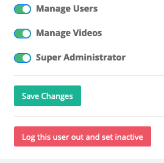

# Managing Users

With GoBlender, users are simple to manage. You can add users who have no access rights to the CMS or any other part of the system, or users who have some or all of the needed roles to maintain things.

## Listing existing users

    <b>Note</b>: In order to manage users, your system administrator must have assigned you the <strong>Users Role</strong>.

To see all existing users, first log into the system, and then choose **Dashboard** from the **wrench menu**. This takes you to the admin tool dashboard page.

From the menu on the left, choose **Admin Users** -> **All Users**. This takes you to the Admin Users page. From here, you have a list of all admin users, both active and inactive. To search the list, just type
in the search box on the top right of the table.

## Editing existing users

To view or manage a specific user, click on the user's last name, and you will be taken to the Admin User screen. From here, you can edit whatever information you wish about the user, and turn specific roles on or off.

    <b>Note</b>: If a users accesses the system through social media login, you cannot change his or her password, since the password is managed by whatever social media login he or she is using.

Be sure to save your changes.

## Adding a user

To add a user to the system, first log into the system, and then choose **Dashboard** from the **wrench menu**. This takes you to the admin tool dashboard page.

From the menu on the left, choose **Admin Users** -> **Add User**. This takes you to the Admin Users page.  First enter the basic information about the user, and save your changes. Then assign whatever roles
you wish to give to the user, and save those changes.

## Removing or disabling users

Because the audit trail built into GoBlender depends on user information, you cannot actually delete a user from the system. You can, however, disable access by setting the user to inactive.

If removing a user is urgent, you can view the user information, and then click on the red **Log this user out and set inactive**, which will immediately (even if the user is currently logged in) remove all
access to the system for that particular user.

    

Note that you cannot, for obvious reasons, lock yourself out of the system, so the button to do so **does not appear** when you are looking at **your own account**.
